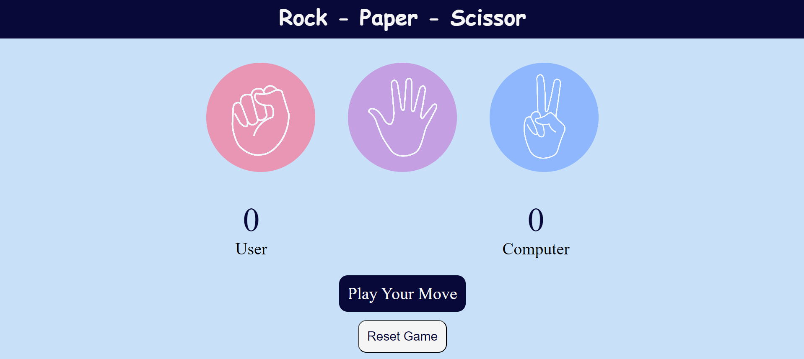

# Rock Paper Scissors: The AI Opponent

## Description

This is a simple Rock Paper Scissors game built using HTML, CSS, and JavaScript. The user can play against the computer, and the score is tracked for both the user and the computer. The game features a responsive design and an AI strategy where the computer adapts its moves based on the user's consecutive choices.

## Features

- User Choice: User can choose Rock, Paper, or Scissors.
- Computer Strategy: The computer selects moves based on the user's consecutive choices. If the user repeats a move twice, the computer chooses the winning move against that choice; otherwise, it selects a random move.
- Score Tracking: The game declares a winner for each round and updates the score.
- Reset Option: The game can be reset at any time to start fresh.

## Technologies Used

- HTML
- CSS
- JavaScript

## Getting Started

### Prerequisites

To run this project, you need a web browser.

### Installation

1. Clone the repository:

   ```bash
   git clone https://github.com/RohitS511/Rock-Paper-Scissor-Game.git
   ```

2. Navigate to the project directory:

   ```bash
   cd rock-paper-scissors
   ```

### Usage

1. Open the `index.html` file in your web browser.
2. Enter your name when prompted.
3. Click on one of the choices (Rock, Paper, or Scissors) to play the game.
4. The result of the game will be displayed, and the scores will be updated accordingly.
5. Click the "Reset Game" button to reset the scores and start a new game.

## Project Structure

- `index.html`: The main HTML file that contains the structure of the game.
- `style.css`: The CSS file for styling the game.
- `app.js`: The JavaScript file containing the game logic.

## Screenshots



## Contributing

Contributions are welcome! Please open an issue or submit a pull request for any improvements or bug fixes.

## License

This project is licensed under the MIT License. See the [LICENSE](LICENSE) file for details.

## Acknowledgements

- Inspired by the classic Rock Paper Scissors game.
